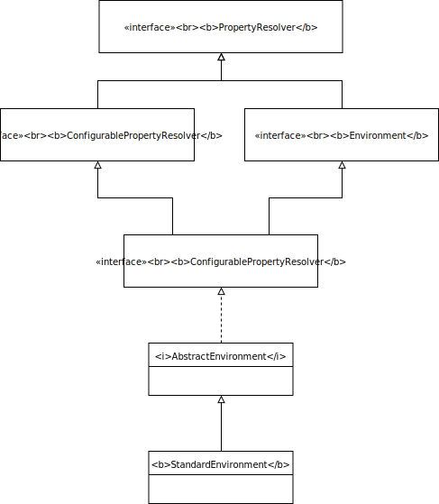

- [] finish reading ApplicationContext
```java
public class App {
    public static void main(String[] args){
        ClassPathXmlApplicationContext context = new ClassPathXmlApplicationContext("basicConfig.xml");
        SimpleBean bean = context.getBean(SimpleBean.class);
        bean.doSomething();
        context.close();
    }
}
```
## ClassPathXmlApplicationContext
### Class Diagram

#### ResourceLoader
This is the strategy interface (see [strategy pattern](https://en.wikipedia.org/wiki/Strategy_pattern)) for loading resources (e.g. class path or file system resources).An `org.springframework.context.ApplicationContext` is required to provide this functionality, plus extended `org.springframework.core.io.support.ResourcePatternResolver` support.

`DefaultResourceLoader` is a standalone implementation that is
usable outside an ApplicationContext, also used by `ResourceEditor`.

Bean properties of type Resource and Resource array can be populated
from Strings when running in an ApplicationContext, using the particular
context's resource loading strategy.

getResource:
```java
Resource getResource(String location);
```
- Must support fully qualified URLs, e.g. "file:C:/test.dat".
- Must support classpath pseudo-URLs, e.g. "classpath:test.dat".
- Should support relative file paths, e.g. "WEB-INF/test.dat".
#### ResourcePatternResolver

 * Strategy interface for resolving a location pattern (for example,
 * an Ant-style path pattern) into Resource objects.

### Constructor
```java
public ClassPathXmlApplicationContext(String[] configLocations, boolean refresh, @Nullable ApplicationContext parent) throws BeansException { 
    super(parent); // parent default to null
    setConfigLocations(configLocations);
    if (refresh) { // default to true
        refresh();
    }
}
```
#### Superclass constructor
The call to `super(parent)` goes up the inheritance chain until `AbstractApplicationContext`:
```java
public AbstractApplicationContext(@Nullable ApplicationContext parent) {
    this();
    setParent(parent);
}

public AbstractApplicationContext() {
    this.resourcePatternResolver = getResourcePatternResolver();
}
```
    
##### getResourcePatternResolver:
```java
protected ResourcePatternResolvergetResourcePatternResolver() {
    return new PathMatchingResourcePatternResolver(this);
}
```
supporting Ant-style location patterns.
#### setConfigLocations
This method is actually from `AbastractRefreshableConfigApplicationContext.setConfigLocations`:
```java
public void setConfigLocations(@Nullable String... locations) {
    if (locations != null) {
        Assert.noNullElements(locations, "Config locations must not be null");
        this.configLocations = new String[locations.length];
        for (int i = 0; i < locations.length; i++) {
            this.configLocations[i] = resolvePath(locations[i]).trim();
        }
    }
    else {
        this.configLocations = null;
    }
}
```
##### resolvePath:
calling `AbastractRefreshableConfigApplicationContext.resolvePath`:
```java
protected String resolvePath(String path) {
	return getEnvironment().resolveRequiredPlaceholders(path);
}    
```
The purpose of the `resolvePath` method is to replace the placeholder with environment properties. 

`getEnvironment` is from the `ConfigurableApplicationContext` interface, and implemented in `AbstractApplicationContext`.  
```java
public ConfigurableEnvironment getEnvironment() {
    if (this.environment == null) {
	    this.environment = createEnvironment();
    }
    return this.environment;
}
```

<!--test-->

<!--test-->

### Refresh
