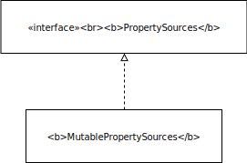

- [ ] finish reading ApplicationContext

- [ClassPathXmlApplicationContext](#classpathxmlapplicationcontext)
  - [Class Diagram](#class-diagram)
    - [ResourceLoader](#resourceloader)
    - [ResourcePatternResolver](#resourcepatternresolver)
  - [Constructor](#constructor)
    - [Superclass constructor](#superclass-constructor)
  - [setConfigLocations](#setconfiglocations)
    - [Environment](#environment)
      - [Profile](#profile)
      - [Property](#property)
    - [StandartEnvironment constructor](#standartenvironment-constructor)
      - [PropertySources](#propertysources)
      - [PropertySource](#propertysource)
    - [resolvePath](#resolvepath)
      - [PropertyResolver](#propertyresolver)
    - [Conclusion](#conclusion)
- [Refresh](#refresh)
  - [prepareRefresh](#preparerefresh)
    - [initPropertySources](#initpropertysources)
    - [validateRequiredProperties](#validaterequiredproperties)
  - [obtainFreshBeanFactory](#obtainfreshbeanfactory)
    - [Inheritance Hierachy](#inheritance-hierachy)
    - [customizeBeanFactory](#customizebeanfactory)
    - [loadBeanDefinition](#loadbeandefinition)
  - [prepareBeanFactory(beanFactory)](#preparebeanfactorybeanfactory)
  - [postProcessBeanFactory(beanFactory)](#postprocessbeanfactorybeanfactory)
  - [invokeBeanFactoryPostProcessors(beanFactory)](#invokebeanfactorypostprocessorsbeanfactory)
  - [registerBeanPostProcessors(beanFactory)](#registerbeanpostprocessorsbeanfactory)
  - [initMessageSource](#initmessagesource)
  - [initApplicationEventMulticaster](#initapplicationeventmulticaster)
  - [onRefresh](#onrefresh)
  - [registerListeners](#registerlisteners)
  - [finishBeanFactoryInitialization(beanFactory)](#finishbeanfactoryinitializationbeanfactory)
  - [finishRefresh](#finishrefresh)

# ClassPathXmlApplicationContext
```java
public class App {
    public static void main(String[] args){
        ClassPathXmlApplicationContext context = new ClassPathXmlApplicationContext("basicConfig.xml");
        SimpleBean bean = context.getBean(SimpleBean.class);
        bean.doSomething();
        context.close();
    }
}
```
## Class Diagram

### ResourceLoader
This is the strategy interface (see [strategy pattern](https://en.wikipedia.org/wiki/Strategy_pattern)) for loading resources (e.g. class path or file system resources).An `org.springframework.context.ApplicationContext` is required to provide this functionality, plus extended `org.springframework.core.io.support.ResourcePatternResolver` support.

`DefaultResourceLoader` is a standalone implementation that is
usable outside an ApplicationContext, also used by `ResourceEditor`.

Bean properties of type Resource and Resource array can be populated
from Strings when running in an ApplicationContext, using the particular
context's resource loading strategy.

getResource:
```java
Resource getResource(String location);
```
- Must support fully qualified URLs, e.g. "file:C:/test.dat".
- Must support classpath pseudo-URLs, e.g. "classpath:test.dat".
- Should support relative file paths, e.g. "WEB-INF/test.dat".
### ResourcePatternResolver

 * Strategy interface for resolving a location pattern (for example,
 * an Ant-style path pattern) into Resource objects.

## Constructor
```java
public ClassPathXmlApplicationContext(String[] configLocations, boolean refresh, @Nullable ApplicationContext parent) throws BeansException { 
    super(parent); // parent default to null
    setConfigLocations(configLocations);
    if (refresh) { // default to true
        refresh();
    }
}
```
### Superclass constructor
The call to `super(parent)` goes up the inheritance chain until `AbstractApplicationContext`:
```java
public AbstractApplicationContext(@Nullable ApplicationContext parent) {
    this();
    setParent(parent);
}

public AbstractApplicationContext() {
    this.resourcePatternResolver = getResourcePatternResolver();
}
```
    
getResourcePatternResolver:
```java
protected ResourcePatternResolvergetResourcePatternResolver() {
    return new PathMatchingResourcePatternResolver(this);
}
```
supporting Ant-style location patterns.
## setConfigLocations
This method is actually from `AbastractRefreshableConfigApplicationContext.setConfigLocations`:
```java
public void setConfigLocations(@Nullable String... locations) {
    if (locations != null) {
        Assert.noNullElements(locations, "Config locations must not be null");
        this.configLocations = new String[locations.length];
        for (int i = 0; i < locations.length; i++) {
            this.configLocations[i] = resolvePath(locations[i]).trim();
        }
    }
    else {
        this.configLocations = null;
    }
}
```
resolvePath:

calling `AbastractRefreshableConfigApplicationContext.resolvePath`:
```java
protected String resolvePath(String path) {
	return getEnvironment().resolveRequiredPlaceholders(path);
}    
```
The purpose of the `resolvePath` method is to replace the placeholder with environment properties. 

`getEnvironment` is from the `ConfigurableApplicationContext` interface, and implemented in `AbstractApplicationContext`.  
```java
public ConfigurableEnvironment getEnvironment() {
    if (this.environment == null) {
	    this.environment = createEnvironment();
    }
    return this.environment;
}
```
if environement is not already assigned, a `StandartEnvironment` is created and assigned to it.


### Environment

Interface representing the environment in which the current application is running. Models two key aspects of the application: **profiles** and **properties**. The method related to property access are exposed via the `PropertyResolver` superinterface.

#### Profile
Profile is introduced in Spring 3.1. A profile is a named logical group of bean definitions. These bean definitions are to be registered with the container, if the given profile is active. Beans can be assigned to a profile via XML or via `@Profile` annotation.

The role of the `Environment` w.r.t the profile is in determining which profiles are currently active, and which profiles should be active by default.

#### Property
properties can come from the different sources: properties files, JVM system properties, system environment variables, JNDI, servlet context parameters, ad-hoc Properties objects, Maps...

The role of the `Environment` w.r.t properties is to provider the user with a service inteface to:
- configure property sources, and
- resolve property form sources.

### StandartEnvironment constructor
uses the constructor in superclass `AbstractEnvironment`
```java
private final MutablePropertySources propertySources = new MutablePropertySources(this.logger);
public AbstractEnvironment() {
    customizePropertySources(this.propertySources);
}
```
#### PropertySources

The interface is a holder for one or more `PropertySource` objects. `MutablePropertySources` is the default implementation.

It stores the objects internally using a `CopyOnWriteArrayList`

customizePropertySources from `AbastractEnvironment` has an empty implementation, the overriden behavior in StandardEnvironment is:
```java
/** System environment property source name: {@value}. */
public static final String SYSTEM_ENVIRONMENT_PROPERTY_SOURCE_NAME = "systemEnvironment";

/** JVM system properties property source name: {@value}. */
public static final String SYSTEM_PROPERTIES_PROPERTY_SOURCE_NAME = "systemProperties";

@Override
protected void customizePropertySources(MutablePropertySources propertySources) {
    propertySources.addLast(new MapPropertySource(SYSTEM_PROPERTIES_PROPERTY_SOURCE_NAME, getSystemProperties()));
    propertySources.addLast(new SystemEnvironmentPropertySource(SYSTEM_ENVIRONMENT_PROPERTY_SOURCE_NAME, getSystemEnvironment()));
}
```
getSystemProperties and getSystemEnvironment are from the `ConfigurableEnvironment` interface, the implementations in `AbstractEnvironment` are used.

`getSystemProperties` delegates to `System.getProperties` to get all system properties at once. If the SecurityManager is preventing read/write access, it fall back to getting single read-only property individually with `System.getProperty(key)`.

The same for `getSystemEnvironment`, except it delegates to `System.getEnv`.

#### PropertySource


`TODO: make diagram.`

### resolvePath
the resolvePath method in setConfigLocations delegates to `AbstractEnvironment.resolveRequiredPlaceholder(path)`

```java
private final ConfigurablePropertyResolver propertyResolver = 
        new PropertySourcesPropertyResolver(this.propertySources);

public String resolveRequiredPlaceholders(String text) throws IllegalArgumentException {
	return this.propertyResolver.resolveRequiredPlaceholders(text);
}
```

#### PropertyResolver


PropertyResolver is the interface for resolving PropertyResource. We are actually calling `AbastractPropertyResolver.resolveRequiredPlaceholders`:

```java
public String resolveRequiredPlaceholders(String text) throws IllegalArgumentException {
    if (this.strictHelper == null) {
        this.strictHelper = createPlaceholderHelper(false);
    }
    return doResolvePlaceholders(text, this.strictHelper);
}

private PropertyPlaceholderHelper createPlaceholderHelper(boolean ignoreUnresolvablePlaceholders) {
    //first 3 parameters are "${", "}" and ":"
    return new PropertyPlaceholderHelper(this.placeholderPrefix, this.placeholderSuffix, this.valueSeparator, ignoreUnresolvablePlaceholders);
}
```
```java
private String doResolvePlaceholders(String text, PropertyPlaceholderHelper helper) {
	return helper.replacePlaceholders(text, this::getPropertyAsRawString);
}
```
getPropertyAsRawString is implemented in PropertySourcesPropertyResolver:
```java
@Override
@Nullable
protected String getPropertyAsRawString(String key) {
    return getProperty(key, String.class, false);
}
```

### Conclusion
what setConfigLocations does is taking the locations passed into the constructor and replace the placeholders with correct system property/environment. results is config paths with placeholders replaced.

# Refresh
```java
@Override
public void refresh() throws BeansException, IllegalStateException {
	synchronized (this.startupShutdownMonitor) {
		// Prepare this context for refreshing.
		prepareRefresh();

		// Tell the subclass to refresh the internal bean factory.
		ConfigurableListableBeanFactory beanFactory = obtainFreshBeanFactory();

		// Prepare the bean factory for use in this context.
		prepareBeanFactory(beanFactory);

		try {
			// Allows post-processing of the bean factory in context subclasses.
			postProcessBeanFactory(beanFactory);

			// Invoke factory processors registered as beans in the context.
			invokeBeanFactoryPostProcessors(beanFactory);

			// Register bean processors that intercept bean creation.
			registerBeanPostProcessors(beanFactory);

			// Initialize message source for this context.
			initMessageSource();

			// Initialize event multicaster for this context.
			initApplicationEventMulticaster();

			// Initialize other special beans in specific context subclasses.
			onRefresh();

			// Check for listener beans and register them.
			registerListeners();

			// Instantiate all remaining (non-lazy-init) singletons.
			finishBeanFactoryInitialization(beanFactory);

			// Last step: publish corresponding event.
			finishRefresh();
		}

		catch (BeansException ex) {
			if (logger.isWarnEnabled()) {
				logger.warn("Exception encountered during context initialization - " +
						"cancelling refresh attempt: " + ex);
			}

			// Destroy already created singletons to avoid dangling resources.
			destroyBeans();

			// Reset 'active' flag.
			cancelRefresh(ex);

			// Propagate exception to caller.
			throw ex;
		}

		finally {
			// Reset common introspection caches in Spring's core, since we
			// might not ever need metadata for singleton beans anymore...
			resetCommonCaches();
		}
	}
}
```

## prepareRefresh
```java
protected void prepareRefresh() {
	this.startupDate = System.currentTimeMillis();
	this.closed.set(false);
	this.active.set(true);
	// Initialize any placeholder property sources in the context environment
	initPropertySources();
	// Validate that all properties marked as required are resolvable
	// see ConfigurablePropertyResolver#setRequiredProperties
	getEnvironment().validateRequiredProperties();
	// Allow for the collection of early ApplicationEvents,
	// to be published once the multicaster is available...
	this.earlyApplicationEvents = new LinkedHashSet<>();
}
```
### initPropertySources
empty implementation, do noting by default
### validateRequiredProperties
AbstractEnvironment.validateRequiredProperties
```java
@Override
public void validateRequiredProperties() throws MissingRequiredPropertiesException {
    this.propertyResolver.validateRequiredProperties();
}
```
AbstractPropertyResolver.validateRequiredProperties
```java
@Override
public void validateRequiredProperties() {
    MissingRequiredPropertiesException ex = new MissingRequiredPropertiesException();
    for (String key : this.requiredProperties) {
    	if (this.getProperty(key) == null) {
    		ex.addMissingRequiredProperty(key);
    	}
    }
    if (!ex.getMissingRequiredProperties().isEmpty()) {
    	throw ex;
    }
}
```
the required properties can be marked by using setRequiredProperties method in AbstractEnvironment. The properties are stored in a Set. The default is empty, no validation needed.

## obtainFreshBeanFactory
```java
protected ConfigurableListableBeanFactory obtainFreshBeanFactory() {
	refreshBeanFactory();
	return getBeanFactory();
}
```

call to `AbstractRefreshableApplicationContext.refreshBeanFactory`:
```java
protected final void refreshBeanFactory() throws BeansException {
	if (hasBeanFactory()) {
		destroyBeans();
		closeBeanFactory();
	}
	try {
		DefaultListableBeanFactory beanFactory = createBeanFactory();
		beanFactory.setSerializationId(getId());
		customizeBeanFactory(beanFactory);
		loadBeanDefinitions(beanFactory);
		synchronized (this.beanFactoryMonitor) {
			this.beanFactory = beanFactory;
		}
	}
	catch (IOException ex) {
		throw new ApplicationContextException("I/O error parsing bean definition source for " + getDisplayName(), ex);
	}
}
```
Here exisiting BeanFactory (if any) is destroyed and a new BeanFactory is created. The one created is a DefaultListableBeanFactory.

if the file has a `DOCTYPE` definition then DTD validation is used, otherwise XSD is assumed.

[XSD vs DTD参考](https://stackoverflow.com/questions/1544200/what-is-difference-between-xml-schema-and-dtd)

[xml解析参考](https://www.ibm.com/developerworks/cn/xml/dm-1208gub/index.html)

[bean name or id](https://stackoverflow.com/questions/874505/difference-between-using-bean-id-and-name-in-spring-configuration-file)

- [ ] what is JAXP (Java API for XML processing)

### Inheritance Hierachy
- [ ] insert diagram here.
### customizeBeanFactory
### loadBeanDefinition

## prepareBeanFactory(beanFactory)
## postProcessBeanFactory(beanFactory)
## invokeBeanFactoryPostProcessors(beanFactory)
## registerBeanPostProcessors(beanFactory)
## initMessageSource
## initApplicationEventMulticaster
## onRefresh
## registerListeners
## finishBeanFactoryInitialization(beanFactory)
## finishRefresh
